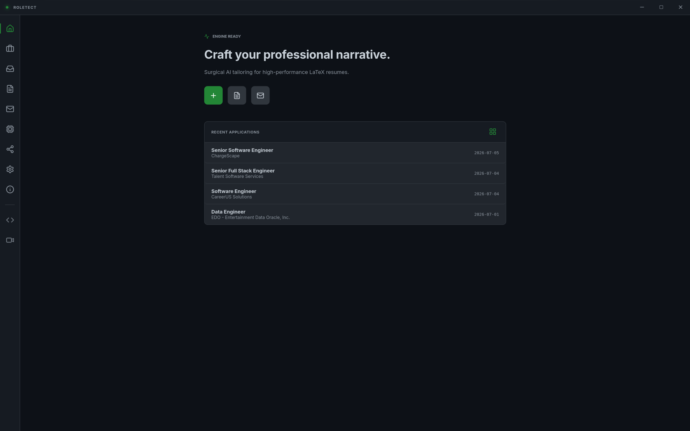
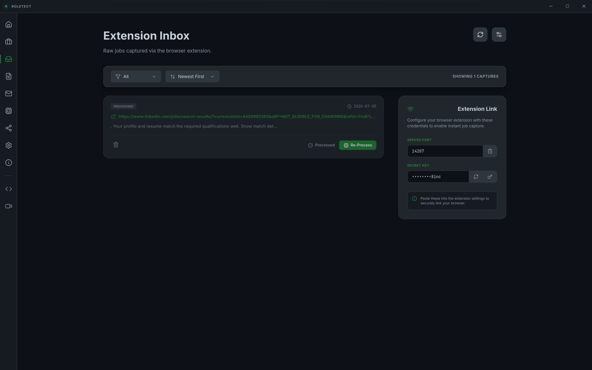
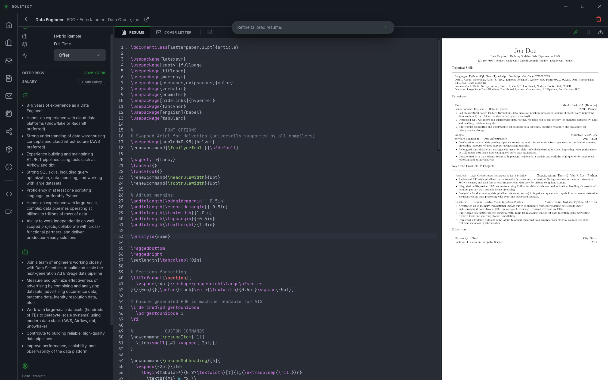
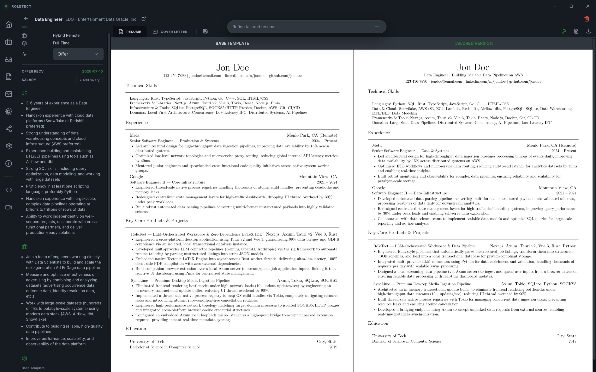
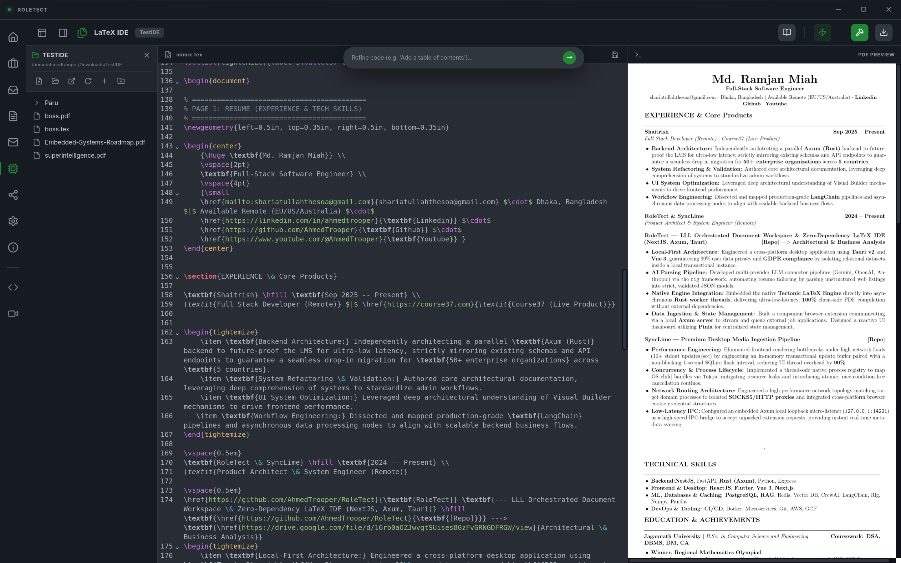
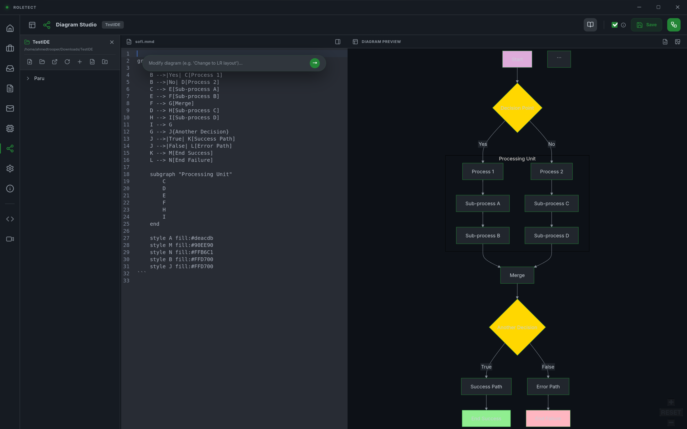
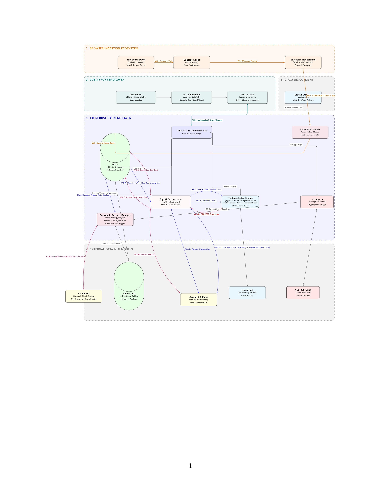

[📐 Project Architecture](https://drive.google.com/drive/folders/1HPm-OfIUxNmZBD-hPUmnSqStH3QZJt60?usp=sharing)

# RoleTect

### 🚀 **[Firefox Extension (AVAILABLE NOW)](https://addons.mozilla.org/en-US/firefox/addon/roletect-ingest/)** | 🚧 **Chrome Extension (COMING SOON)**

[](https://addons.mozilla.org/en-US/firefox/addon/roletect-ingest/)
[📄 Read the RoleTect Report](./assets/RoleTect_Architecture.pdf) — *Explains the architectural, business, and privacy value of RoleTect.*

RoleTect is a local-first, privacy-focused desktop application and companion browser extension designed to organize the job application process, parse job descriptions, and tailor LaTeX-based resumes and cover letters using on-device or API-driven AI models.

<table>
  <tr>
    <td width="50%"></td>
    <td width="50%"></td>
  </tr>
  <tr>
    <td width="50%"></td>
    <td width="50%"></td>
  </tr>
  <tr>
    <td width="50%"></td>
    <td width="50%"></td>
  </tr>
</table>

---

## 🏗️ System Architecture

The following diagram illustrates how the components of RoleTect interact, from web scraping to secure key retrieval, database storage, and local compilation.



---

## 🎯 Core Features & Technical Implementation

### 1. Zero-Trust API Key Storage (IOTA Stronghold Enclave)
*   **The Issue:** Storing API keys in plaintext files or standard databases leaves them vulnerable to extraction by local malware.
*   **The Solution:** RoleTect utilizes `tauri-plugin-stronghold` to create an encrypted database enclave (`secrets.stronghold`) utilizing Argon2 key derivation.
*   **Runtime Security:** A cryptographically random 256-bit passkey is generated at first run and stored locally. API credentials are decrypted on-the-fly inside Rust command memory only when executing AI calls, and are never saved to the SQLite database.

### 2. Dual-Purpose Local Axum Server
*   **Dynamic Port Bindings & Auth:** At startup, the Tauri backend spins up an Axum server on an available port. The browser extension communicates using a dynamic 32-character secret key.
*   **Chunked PDF Streaming:** Beyond just receiving job payloads from the extension, the server is uniquely engineered to serve compiled PDFs back to the frontend chunk by chunk. This data-streaming architecture ensures that massive PDFs load instantly without freezing or slowing down the Vue 3 UI.

### 3. Token-Squashing Scraper Pipeline
*   **Efficiency:** Raw HTML bloats token counts and incurs unnecessary API costs.
*   **DOM Sanitation:** The extension cleans the webpage DOM before transmission, stripping scripts, CSS styles, images, inline SVGs, iframes, navbars, and buttons.
*   **Text Processing:** The content script runs a regex pipeline to collapse vertical spacing, convert returns into periods, eliminate horizontal gaps, and squash duplicate periods.

### 4. On-Device Tectonic LaTeX Compilation & Powerful IDE
*   **Architecture & Workaround:** To bypass the requirement of a system-wide LaTeX installation, RoleTect embeds the **Tectonic compiler** directly into a background thread. We solved persistent stack overflow issues with complex LaTeX templates by significantly increasing the thread stack size to 100MB.
*   **Pre-Caching for Offline Use:** We implemented a custom template that caches over 85 essential scientific and layout packages initially. This allows developers to run and compile complex documents completely offline after the initial setup.
*   **Workspace Performance:** The built-in LaTeX IDE provides a seamless, side-by-side editing experience with CodeMirror. It instantly compiles and previews PDFs without UI lag.

### 5. Advanced Job Application Workspace
*   **Side-by-Side Comparison:** Users can instantly toggle between their base resume/CV and the AI-tailored version to review exactly what the AI changed.
*   **Precision AI Input Box:** For any tailored job, users have an interactive AI input box to dictate specific changes—whether generating a brand new section from scratch or updating a specific bullet point to better match the job requirements.
*   **Self-Healing Compilation:** RoleTect leverages the Rig AI library for self-healing pipelines. If the AI-generated LaTeX compiles successfully, it is saved automatically. If compilation fails, the system catches the error logs and provides a one-click "AI Fix" option to automatically debug and resolve syntax issues.

### 6. S3 Cloud Backup & Complete Offline Capability
*   **S3 Cloud Sync:** Users can securely back up their entire SQLite database and workspaces to an S3-compatible cloud (AWS, Cloudflare R2, etc.). S3 credentials are saved securely in the OS keyring (Stronghold).
*   **Intelligent Restore:** When restoring, users have the option to safely merge cloud data with their local database or completely overwrite it. 
*   **Graceful Shutdown:** The app purposefully delays closing to ensure auto local and cloud backups complete successfully.
*   **Multi-Provider LLM & Offline AI:** Integrates with Gemini, OpenAI, Anthropic, Groq, and Bedrock. If a user's computer can handle powerful models, they can route all AI tailoring and debugging through Ollama. Combined with the pre-cached LaTeX packages, the entire application can run 100% offline.

### 7. AI-Assisted Technical Diagramming Workspace
*   **Interactive Visual Canvas:** Incorporates a dedicated workspace for creating, editing, and rendering Mermaid.js flowcharts, sequence diagrams, and ER diagrams.
*   **Interactive Panning & Zooming:** Uses `svg-pan-zoom` to allow users to interact with large, complex layouts.
*   **AI Synthesis & Repair:** Features specialized commands (`refine_diagram_with_ai`, `fix_diagram_with_ai`) that use AI to dynamically build, refine, and debug diagrams from conversational natural language instructions.

---

## 📂 Project Structure

```text
├── application/             # Standalone assets & icons
├── src-tauri/               # Tauri Rust Backend
│   ├── src/
│   │   ├── commands/        # Tauri command handlers (settings, compiler, database)
│   │   ├── ai.rs            # Rig LLM integration & prompt templates
│   │   ├── db.rs            # rusqlite database initialization and migrations
│   │   ├── lib.rs           # Tauri app setup & plugin registration
│   │   └── server.rs        # Axum local server
│   └── Cargo.toml           # Rust backend dependencies
├── src/                     # Vue 3 Frontend
│   ├── components/          # Views & UI Components (Editor, Job Tracker, Settings)
│   ├── store/               # Pinia State Management (Settings, Jobs, Resumes)
│   └── App.vue              # Main App wrapper
├── extentions/              # Browser Extensions
│   ├── chrome/              # Manifest V3 extension code
│   └── firefox/             # Firefox compatible manifest extension code
└── README.md
```

---

## 🚀 Installation & Setup

### 1. Standard Installation (Recommended)
The easiest way to get started is to download the pre-compiled application and official extension.

*   **Desktop App:** Download the latest installer for your operating system from the [Releases](https://github.com/AhmedTrooper/RoleTect/releases) page.
*   **Browser Extension:** Install the official companion extension to scrape and send job descriptions to the app.
    *   **Firefox Users:** [🦊 Install Firefox Add-on](https://addons.mozilla.org/en-US/firefox/addon/roletect-ingest/) (Available Now)
    *   **Chrome/Edge Users:** Download the `roletect-chrome-extension.zip` file from the [Releases](https://github.com/AhmedTrooper/RoleTect/releases) page. Extract the zip file, navigate to `chrome://extensions` in your browser, enable **Developer Mode**, click **Load unpacked**, and select the extracted folder.

> **Connecting the Extension:** Once installed, click the extension icon in your browser. Copy the **Secret Key** and **Active Server Port** from the *Inbox* or *Settings* tab in the RoleTect desktop app and paste them into the extension to authenticate the secure connection.

---

### 2. Developer Setup & Local Execution
If you wish to build from source or install the appication manually:

#### Prerequisites
*   [Node.js](https://nodejs.org/) (v18+)
*   [Rust Compiler & Cargo](https://www.rust-lang.org/)
*   [Bun Package Manager](https://bun.sh/) (Recommended, or npm)

#### Backend & Frontend Build
1.  **Clone the Repository:**
    ```bash
    git clone https://github.com/AhmedTrooper/RoleTect.git
    cd RoleTect
    ```
2.  **Install Dependencies:**
    ```bash
    bun install
    # or npm install
    ```
3.  **Run Development Environment:**
    ```bash
    bun run tauri dev
    # or npm run tauri dev
    ```


---

## 🎬 Tutorial & Quick Start

[▶️ Watch the Complete Software Usage Video & Project Assets](https://drive.google.com/drive/folders/1HPm-OfIUxNmZBD-hPUmnSqStH3QZJt60?usp=sharing)

### What You Can Instantly Do
Once you've installed the desktop app and browser extension, you can instantly:
1. Browse to any job posting online and click the RoleTect extension to securely send the job data to the app.
2. The app will automatically parse the requirements and responsibilities.
3. Use the built-in AI tools to automatically tailor your Base Resume to match the job description, and watch it compile the final PDF instantly.

### Configuring Your Settings
Before tailoring, you need to configure your AI providers. Head over to the **Settings Tab** in the desktop application.

*   **AI Credentials:** RoleTect requires an API key to function unless you are running local models via Ollama. 
    *   *Google Gemini:* Get a free API key from [Google AI Studio](https://aistudio.google.com/).
    *   *Groq:* Get blazing fast API keys from the [GroqConsole](https://console.groq.com/).
    *   Once you have a key, paste it into the respective provider section in the Settings page. These keys are securely encrypted in the IOTA Stronghold vault.
*   **S3 Cloud Backup:** If you want to back up your resumes and job history to the cloud:
    *   Create an S3 bucket (Any S3-compatible provider is supported, e.g., AWS, Cloudflare R2, MinIO, etc.).
    *   In the Settings tab, enter your `Access Key`, `Secret Key`, `Bucket Name`, and `Endpoint URL`.
    *   Toggle "Auto Cloud Backup" to sync your local SQLite database seamlessly.

---

## 📊 Model & Data Card

### 1. Model Summary
*   **Recommended Models:** `gemini-1.5-pro` / `gemini-1.5-flash` (via Google AI Studio), `gpt-4o` / `gpt-4o-mini` (via OpenAI), or `llama3-70b-8192` (via Groq).
*   **Local Inference:** Compatible with any GGUF running via `ollama` locally (e.g., `llama3:8b`).
*   **AI Roles:**
    *   **Parser:** Evaluates raw text/URL crawled data and maps it to a JSON schema defining validation properties (job details, responsibilities, requirements).
    *   **Tailoring Engine:** Injects matching skills and structural details directly into LaTeX resume structures while conserving compilability.
    *   **Debugger:** Ingests Tectonic error logs and broken code strings to resolve LaTeX syntax errors.

### 2. Data Processing Policy
*   **Zero-Cloud Storage:** RoleTect operates no remote application servers. Job details, resumes, templates, and application progress remain in a local SQLite file.
*   **Inference Path:** Data sent to LLMs is routed directly from the desktop client to the selected API provider endpoint via HTTPS. No third-party relays are used.

### 3. Limitations & Considerations
*   **Initial Compiler Latency:** On its first run, the Tectonic engine downloads compiler assets to compile document structures. Subsequent runs utilize the local Tectonic cache.
*   **Offline Compilation:** While LaTeX PDF generation is 100% offline, AI-based parsing and tailoring require a network connection unless a local model is running via Ollama.

---

## 💻 Core Code Highlights
The following are snippets of our most critical engineering implementations, showcasing actual developer rationale rather than generic AI comments.

### 1. Axum Server (Chunked PDF Streaming)
We had to implement chunked streaming because serving 5MB+ compiled PDFs in a single payload to the frontend was causing Vue 3 to freeze.
```rust
// We use tower_http and axum to stream the compiled PDF directly from the temporary 
// compilation directory back to the Vue frontend.
// This prevents memory bloat and keeps the UI thread snappy.
pub async fn serve_pdf(
    Path(job_id): Path<String>,
) -> impl IntoResponse {
    let pdf_path = format!("{}/compilations/{}.pdf", std::env::temp_dir().display(), job_id);
    
    // Attempt to open the file. If it doesn't exist yet, the compiler is still running.
    let file = match tokio::fs::File::open(&pdf_path).await {
        Ok(f) => f,
        Err(_) => return (StatusCode::NOT_FOUND, "PDF not found or still compiling".to_string()).into_response(),
    };

    // Convert the file into a byte stream for chunked transfer
    let stream = tokio_util::io::ReaderStream::new(file);
    let body = axum::body::Body::from_stream(stream);

    // Explicitly set the application/pdf header so the browser/PDF viewer renders it
    Response::builder()
        .status(StatusCode::OK)
        .header(header::CONTENT_TYPE, "application/pdf")
        .body(body)
        .unwrap()
}
```

### 2. Tectonic Stack Size Workaround
One of our biggest technical hurdles was Tectonic overflowing the standard Rust thread stack when parsing complex LaTeX templates like `Awesome-CV`.
```rust
// Standard threads only have 2MB of stack space, which instantly panics Tectonic.
// We spin up a custom thread with 100MB allocated exclusively for the compiler.
pub fn compile_latex_safely(tex_content: String) -> Result<Vec<u8>, String> {
    let builder = std::thread::Builder::new()
        .name("tectonic_compiler_thread".into())
        .stack_size(100 * 1024 * 1024); // 100MB stack limit

    let handler = builder.spawn(move || {
        // Run the tectonic engine safely inside this massive stack context
        let mut compiler = tectonic::Compiler::new();
        // ... compilation logic ...
    }).map_err(|e| format!("Failed to spawn compiler thread: {}", e))?;

    handler.join().unwrap()
}
```

### 3. Agentic Orchestration with Rig AI
To make the application truly agentic, we utilized the Rust `rig` library. We unified the extraction capabilities across multiple distinct AI providers, injecting a dual-capability system prompt directly into Rig's schema extractor to enforce reliable JSON validation from LLMs.
```rust
// We inject a specialized system prompt into the Rig extractor.
// Rig handles the underlying HTTP complexities and JSON deserialization 
// for 7 different AI providers using the exact same interface.
pub async fn parse_job_description(
    provider: &str,
    model: &str,
    api_key: &str,
    input_text: &str,
) -> Result<JobDetails, String> {
    let system_prompt = "You are an expert job details extractor.
TASK: Extract structured job details. Prioritize manual RAW DESCRIPTION over URL crawling.";

    match provider {
        "gemini" => {
            let client = gemini::Client::new(api_key).map_err(|e| e.to_string())?;
            client.extractor::<JobDetails>(model)
                .preamble(system_prompt)
                .build()
                .extract(input_text)
                .await
                .map_err(|e| format!("Gemini AI Parsing Error: {}", e))
        },
        // ... (other providers follow the exact same rig architecture)
        _ => Err("Unsupported provider".into()),
    }
}
```

### 4. Direct Cloud Sync (AWS SDK)
To provide users with secure, decentralized backups, we integrated the official `aws-sdk-s3` crate. This allows users to bypass proprietary cloud constraints and back up their entire SQLite database structure to any S3-compatible provider (Cloudflare R2, MinIO, AWS).
```rust
// We build a custom S3 client bypassing default credential chains, 
// pulling securely from the IOTA Stronghold enclave in memory.
pub async fn build_s3_client(config: &S3Config) -> Result<s3::Client, String> {
    let credentials = aws_sdk_s3::config::Credentials::new(
        &config.access_key_id,
        &config.secret_access_key,
        None, // session token
        None, // expiry
        "roletect",
    );

    let s3_config = s3::config::Builder::new()
        .endpoint_url(&config.endpoint_url)
        .region(s3::config::Region::new(config.region.clone()))
        .credentials_provider(credentials)
        .force_path_style(config.force_path_style)
        .behavior_version(s3::config::BehaviorVersion::latest())
        .build();

    Ok(s3::Client::from_conf(s3_config))
}
```

---

## 🔓 Open-Source Attribution & Licensing Directory

In compliance with **Section 10.2** of the SciBlitz AI Challenge 2026 Rulebook, below is the comprehensive attribution list of third-party open-source libraries, engines, and AI models utilized in the development of RoleTect.

### 1. Backend Core & Plugins (Rust)
*   **Tauri v2 Framework** (MIT / Apache-2.0) | Cross-platform runtime orchestration.
*   **Tectonic Engine** (MIT) | Self-contained LaTeX-to-PDF compiler.
*   **Rig AI Framework** (MIT) | Declarative agent structures & LLM connector.
*   **Axum & Tokio** (MIT) | Non-blocking web server and async execution runtime.
*   **IOTA Stronghold** (Apache-2.0 / MIT) | Argon2 secure local database enclave.
*   **rusqlite** (MIT) | Native SQLite wrapper for local relational tracking.
*   **tower-http** (MIT) | CORS and network request middleware layers.

### 2. Frontend Application (Vue 3 / TypeScript)
*   **Vue 3** (MIT) | Declarative user interface runtime.
*   **Vite** (MIT) | Frontend bundler and build system.
*   **Pinia** (MIT) | Global state stores for configurations and workspace files.
*   **CodeMirror** (MIT) | In-browser LaTeX editor canvas.
*   **DOMPurify** (Apache-2.0) | HTML sanitization preventing XSS during ingestion.
*   **Mermaid.js** (MIT) | Client-side markup diagram renderer.
*   **Motion-V** (MIT) | UI transition and micro-animation engine.
*   **svg-pan-zoom** (MIT) | Interactive PDF preview panning tools.

### 3. Pre-trained AI Models (Third-party)
*   **Gemini 1.5 Pro & Flash** (Google AI Studio Terms of Service) | Used for structured job schema parsing and resume template tailoring.
*   **GPT-4o & GPT-4o-mini** (OpenAI APIs Terms of Service) | Supported alternative routing models.
*   **Claude 3.5 Sonnet** (Anthropic API Terms of Service) | High-fidelity LaTeX syntax debugging.
*   **Llama 3 (8B/70B)** (Meta LLaMA 3 License Agreement) | Local inference compatible model via Ollama.
