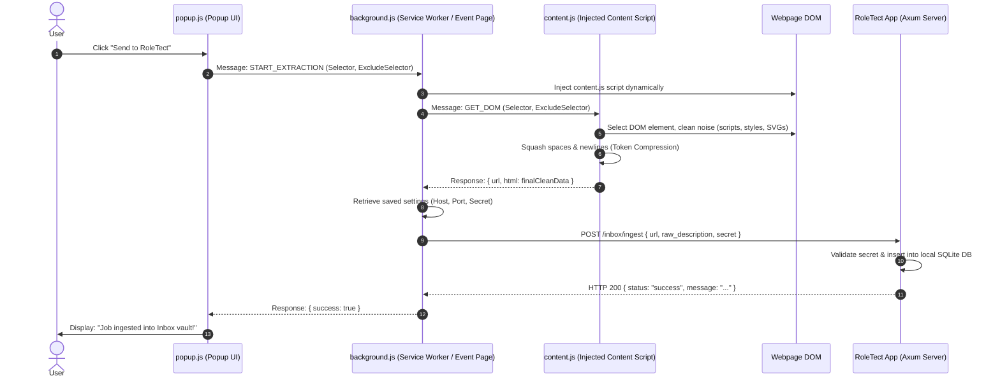

# RoleTect Ingest: Companion Browser Extension Guide

This guide provides a comprehensive tutorial and deep dive on how to load, configure, use, and troubleshoot the companion browser extension for **RoleTect**.

---

## 🔍 Overview & Architecture

The **RoleTect Ingest** browser extension is a privacy-first, local-first capture tool. It allows you to grab job descriptions directly from any website (such as LinkedIn, Indeed, or custom job boards) and ingest them into your local RoleTect application's **Inbox** with a single click.

---

## 🛠️ Step 1: Locate Your Credentials

Before installing the extension, you must obtain your unique local server settings from the main **RoleTect** desktop application.

1. Launch the **RoleTect** desktop application.
2. Navigate to the **Inbox** tab ([InboxTab.vue](file:///home/ahmedtrooper/ProgrammingFiles/Proffes/RoleTect/src/components/InboxTab.vue)).
3. Look at the right-hand sidebar under **Extension Link**:
   * **Server Port**: Usually `14207` (If port `14207` is busy, RoleTect automatically falls back to one of the following ports: `14213`, `1420`, `14229`, `14235`, `14266`, `14247`, `14298`, `14259`, `14280`).
   * **Secret Key**: A unique authentication key generated specifically for your vault.
4. Keep this screen open or copy these values. You will need them to configure the extension.

> [!NOTE]
> If you ever suspect your secret key has been compromised, or if you want to invalidate old browser connections, click the **Regenerate Key** button next to the secret key in the app. This will instantly rotate the secret key in the database and invalidate the previous key.

---

## 🚀 Step 2: Install the Browser Extension

The source code and pre-packaged ZIP files for the extension are located in the [extentions/](file:///home/ahmedtrooper/ProgrammingFiles/Proffes/RoleTect/extentions) directory of this repository.

### Option A: Google Chrome (Brave, Edge, Opera, Vivaldi)

1. Open your browser and navigate to `chrome://extensions/`.
2. Enable **Developer mode** using the toggle switch in the top-right corner.
3. Choose one of the following:
   * **Unpacked Folder**: Click **Load unpacked** in the top-left and select the [chrome/](file:///home/ahmedtrooper/ProgrammingFiles/Proffes/RoleTect/extentions/chrome) folder.
   * **ZIP Archive**: Extract [chrome.zip](file:///home/ahmedtrooper/ProgrammingFiles/Proffes/RoleTect/extentions/chrome.zip) to a folder on your computer, click **Load unpacked**, and select that folder.
4. Pin the **RoleTect Ingest** extension icon (the blue shield/arrow logo) to your browser toolbar.

### Option B: Mozilla Firefox

1. Open Firefox and navigate to `about:debugging` in the URL bar.
2. Click **This Firefox** in the left sidebar menu.
3. Click the **Load Temporary Add-on...** button.
4. Navigate to your [extentions/firefox/](file:///home/ahmedtrooper/ProgrammingFiles/Proffes/RoleTect/extentions/firefox) directory (or extract [firefox.zip](file:///home/ahmedtrooper/ProgrammingFiles/Proffes/RoleTect/extentions/firefox.zip)) and select its `manifest.json` file.
5. The extension is now loaded!

> [!WARNING]
> Firefox removes temporary add-ons when the browser restarts. For permanent use without reloading, the extension must be signed or loaded via a developer version of Firefox with signature verification bypassed. We recommend using Chromium-based browsers for a persistent dev workflow, or re-loading via `about:debugging` as needed.

---

## ⚙️ Step 3: Configure the Extension

Once installed, click the extension icon on your browser toolbar to open the popup.

1. Click on the **Settings** tab.
2. Select your **Connection Type**:
   * **Localhost (127.0.0.1)**: Select this if the RoleTect app is running on the same computer as your browser. Under **Port**, enter the port number displayed in your app (usually `14207`).
   * **Custom Local IP**: Select this if you run the RoleTect app on a separate machine on your local network (e.g., a home server or secondary laptop). Enter the IP address and port.
   * **Remote / Cloud**: Select this if you have self-hosted the backend on a remote server. Enter the full URL (e.g., `https://my-roletect-server.com`).
3. Paste the **Secret Key** that you copied from the app into the **Secret Key** field.
4. Click **Save Configuration**.

> [!IMPORTANT]
> When using a **Custom Local IP** or a **Remote / Cloud** address, your browser will display a permission prompt asking to allow the extension to read/write data to that specific hostname. This is a Manifest V3 security measure. Click **Allow** (or Grant) to save the settings successfully.

---

## 🎯 How to Use: Capturing Job Listings

Navigate to a job listing webpage (e.g., a software engineer post on LinkedIn). Open the extension popup.

### 1. Simple Mode (General Scraping)

Use this mode for any webpage where you haven't set up a specific template.

* **CSS Selector (Include)**: Tells the extension which part of the webpage contains the job details. The default is `body` which extracts text from the entire page.
* **CSS Selector (Exclude)**: Tells the extension which parts to ignore. For example, enter `.sidebar, .footer, header` to strip out navigation menus, footer copy, and advertisements.
* **Save Selectors**: Saves these selectors as your custom defaults for general scraping.
* **Extract & Send**: Click **Send to RoleTect**. The extension will extract, compress, and transmit the data. You will see a green `Job ingested into Inbox vault!` confirmation.

---

### 2. Advanced Mode (Template-Based Scraping)

When scraping popular job boards, toggling **Advanced Mode** lets you use site-specific selectors that only extract the actual job description. This keeps the text extremely concise and token-efficient, saving on AI API costs.

1. Toggle the **Advanced Mode** switch in the **Extract** tab.
2. Choose the matching template from the **Select Site Template** dropdown.
3. Click **Send to RoleTect**.

#### 📦 Pre-configured Built-in Templates:
The extension includes pre-tested selectors for these popular sites:

| Site Name | Include CSS Selector |
| :--- | :--- |
| **LinkedIn** | `.jobs-search__job-details--wrapper` |
| **Indeed** | `#jobDescriptionText` |
| **Glassdoor** | `.JobDetails_jobDescription__uW_fK` |
| **Wellfound (AngelList)** | `.styles_jobDescription__xL_qW` |
| **Y Combinator (Work at a Startup)** | `.job-description` |
| **Greenhouse** | `#content` |
| **Lever** | `.section-wrapper.page-full-width` |
| **Workday** | `[data-automation-id='jobPostingDescription']` |

---

## 🛠️ Managing and Adding Custom Templates

If you frequently visit a job board that isn't built-in, you can easily add a custom template.

### A. How to Find the Right CSS Selector

1. Right-click on the job description text on the webpage and choose **Inspect** (or press `F12`).
2. Move your cursor over the HTML tags in the elements panel. Look for the container element that highlights *only* the job description area in blue.
3. Note its class (starts with `.`) or ID (starts with `#`).
   * *Example*: `
` yields the selector `.job-body-content`.
   * *Example*: `<section id="description-section">` yields the selector `#description-section`.

### B. Add the Custom Site Map

1. In the extension, go to the **Settings** tab.
2. Scroll down to the **Manage Site Maps** section.
3. Enter:
   * **Site Name**: A label for the dropdown (e.g., `TechCareers`).
   * **Include Selector**: The selector you found (e.g., `.job-body-content`).
   * **Exclude Selector** *(Optional)*: Any nested tags to skip (e.g., `.apply-button-container`).
4. Click **Add Site Map**.
5. It will now be selectable in your **Advanced Mode** dropdown!

---

## 💾 Backup & Restore Settings

If you switch browsers or use multiple devices, you can back up your configuration and custom site templates.

* **Export JSON**: Under **Settings**, click **Export JSON**. This downloads a file named `roletect_backup_YYYY-MM-DD.json` containing your custom templates, selected hosts, and options.
* **Import JSON**:
  1. Click **Import JSON** and select your backup file.
  2. Choose a restore method:
     * **Safe (Merge)**: Merges your imported site maps with your existing ones. In case of matching titles, your current settings are preserved.
     * **Unsafe (Overwrite)**: Completely clears local storage and replaces it with the backup configuration.

---

## 🔬 Under the Hood: Token Compression Pipeline

Web pages are filled with heavy HTML elements, trackers, styles, and scripts. To optimize your database storage and minimize token usage when you send the job description to LLMs (Gemini, OpenAI, etc.), the extension performs a sequence of cleanups inside `content.js` ([content.js](file:///home/ahmedtrooper/ProgrammingFiles/Proffes/RoleTect/extentions/chrome/content.js)):

1. **Noise Removal**: Strips out elements matching:
   `script, style, noscript, svg, img, iframe, nav, footer, button, .visually-hidden`.
2. **Exclude Filter**: Removes user-defined excluded tags.
3. **Block Element Extraction**: Traverses and pulls content only from block-level semantic elements:
   `h1, h2, h3, h4, p, li, article, section`.
4. **Token-Squashing Regex Pipeline**:
   * Replaces all lines/carriage returns with simple periods: `.replace(/[\n\r]+/g, ". ")`
   * Squashes multiple spaces into a single space: `.replace(/\s+/g, " ")`
   * Squashes double or multiple periods (e.g., `...`) into one: `.replace(/\.{2,}/g, ".")`
   * Cleans up period-space-period gaps: `.replace(/\. \./g, ".")`

This produces a highly dense, readable, token-friendly string that goes straight to your local SQLite database.

---

## ❓ Troubleshooting

### ❌ Error: "Connection failed. Is your RoleTect instance reachable?"
1. Ensure the **RoleTect** desktop app is open and running.
2. Check the port. In the app under **Inbox**, make sure the **Server Port** matches the port in the extension **Settings** tab.
3. If using **Custom Local IP** or **Remote/Cloud**, make sure you have granted the required host permissions when saving. Check your browser settings under Extensions -> RoleTect Ingest -> Permissions to ensure it has permission to access the site you are trying to query.

### ❌ Error: "Invalid secret key"
1. The secret key in the extension settings must match the secret key shown in the desktop app.
2. In the app, go to **Inbox**, click the **Copy Key** button, open the extension **Settings**, paste it into the **Secret Key** field, and click **Save Configuration**.

### ❌ Error: "Selector '.xyz' not found on this page"
1. The CSS selector you configured (either in Simple Mode or in your Advanced template) was not found on the webpage.
2. Verify you are on the actual job description page and not a search list.
3. Check the selector. Inspect the page to see if the website changed its HTML class names (common for dynamic websites like LinkedIn or Indeed). You can update the selector in **Settings** by clicking **Edit** next to the site name.

---

## 🤝 Contributing
Found a perfect selector for a job board that isn't built-in? Click the **Submit Site Template on GitHub** button in the **Learn** tab of the extension popup. This pre-fills a GitHub Issue with your selector, so we can incorporate it as a default for all users!
